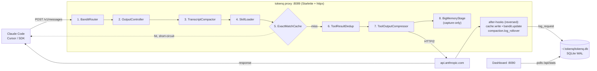
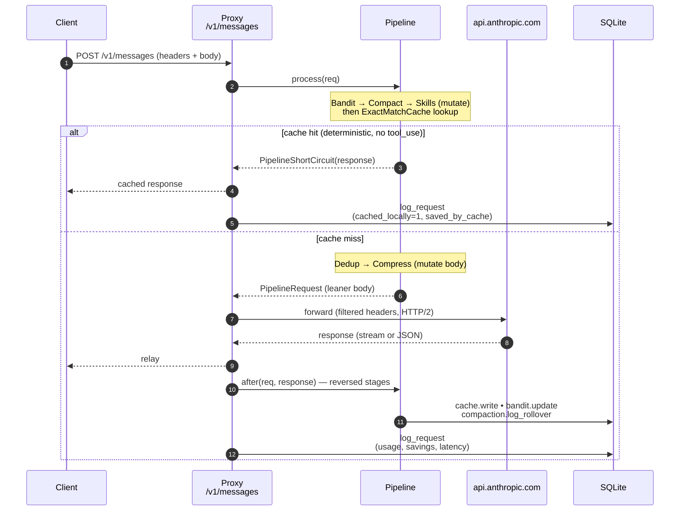
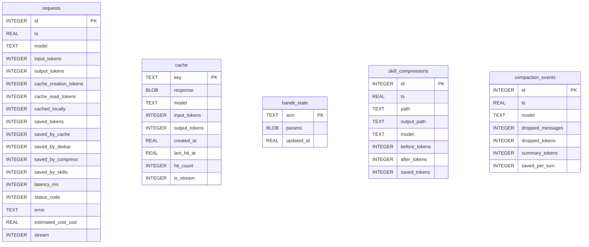

# tokenq

Local proxy that cuts your Claude API bill with quant techniques. Sits on `localhost`, intercepts every request from Claude Code / Cursor / your scripts, applies a pipeline of optimizations, and forwards a leaner version upstream. Telemetry is stored locally in SQLite; a small dashboard renders savings in real time.

**Status:** v0.1 wire-through, v0.2 cache + dedup + compression, v0.3 skill loader + offline `compress-skill`, v0.3+ transcript compaction, v0.4 Thompson-sampling bandit router (opt-in), v0.5 output controller (per-turn `max_tokens` caps), v0.6 `bigmemory` long-term memory + MCP server, plus a detached-daemon CLI (`start --detach` / `stop` / `restart` / `logs`) and a codeburn-style dashboard (per-activity / per-tool / per-shell / per-MCP rollups, one-shot rate, PDF audit report). All stages live in the same pipeline today.

---

## Why this exists

On a long Claude Code session, the bill is dominated by:

1. **`cache_read` on the prefix every turn** — Anthropic charges 0.10× the base input rate per cached token, applied to the *entire* re-sent prefix. On Opus that's still $1.50 per million read tokens, and the prefix grows every turn.
2. **Repeated tool output** — re-reading the same file, re-running the same command, re-emitting verbose terminal output with ANSI escapes and blank-line padding.
3. **Bloated system prompts** — long skill catalogs where 95% of the entries are irrelevant to the current turn.
4. **Tier mismatch** — using Opus for a turn Haiku would have nailed.

Each strategy below targets one of these head terms.

---

## Install & run

```bash
uv sync                     # install
uv run tokenq start         # proxy on 8089, dashboard on 8090, bigmemory MCP on 8091
uv run tokenq start -d      # …same, but detached — survives terminal close

export ANTHROPIC_BASE_URL=http://127.0.0.1:8089
```

Dashboard: <http://127.0.0.1:8090> &nbsp;·&nbsp; bigmemory MCP: <http://127.0.0.1:8091/mcp>

Wire bigmemory into Claude Code as an MCP server (so the model can `memory_search` / `memory_save` against the local store):

```bash
claude mcp add --transport http bigmemory http://127.0.0.1:8091/mcp
```

CLI:

| command | what it does |
|---|---|
| `tokenq start [--detach]` | run proxy (8089) + dashboard (8090) + bigmemory MCP (8091); `-d` backgrounds the process and writes `~/.tokenq/tokenq.pid` |
| `tokenq stop` | stop the detached daemon (uses the PID file) |
| `tokenq restart` | stop + start `--detach` |
| `tokenq logs [-f] [-n N]` | print or `tail -f` the detached-daemon log at `~/.tokenq/tokenq.log` |
| `tokenq status` | proxy liveness + last-24h totals from `~/.tokenq/tokenq.db` |
| `tokenq mcp` | run only the bigmemory MCP server (no proxy, no dashboard) |
| `tokenq reset` | wipe local DB |
| `tokenq compress-skill PATH` | rewrite a SKILL.md into LLM-optimized form via the API |

---

## Architecture

```
┌──────────────┐   POST /v1/messages   ┌───────────────────────────────────────┐                  ┌──────────────┐
│ Claude Code  │ ───────────────────▶  │ tokenq proxy  (Starlette / Uvicorn)   │ ───────────────▶ │ api.anthropic │
│ Cursor / SDK │                       │                                       │                  └──────────────┘
└──────────────┘                       │  Pipeline (in order):                 │
                                       │   1. BanditRouter        (route ↓)    │
                                       │   2. OutputController    (cap/stop)   │
                                       │   3. TranscriptCompactor (drop old)   │
                                       │   4. SkillLoader         (top-K)      │
                                       │   5. ExactMatchCache     (short-ckt)  │
                                       │   6. ToolResultDedup     (mutate)     │
                                       │   7. ToolOutputCompressor(mutate)     │
                                       │                                       │
                                       │  After-hooks (post-upstream):         │
                                       │   - cache.write, bandit.update,       │
                                       │     compaction.log_rollover           │
                                       └────────────────┬──────────────────────┘
                                                        │
                                              writes ▼  │
                                       ┌────────────────────────────┐    polls    ┌────────────────────┐
                                       │ ~/.tokenq/tokenq.db (SQLite│ ◀────────── │ Dashboard  :8090   │
                                       │ WAL, synchronous=NORMAL)   │             │ /api/stats etc.    │
                                       └────────────────────────────┘             └────────────────────┘
```

Same picture rendered as a Mermaid flow (GitHub-rendered):



- `/v1/messages` → pipeline. Everything else under `/v1/*` is a transparent HTTP/2 passthrough (`httpx`).
- A pipeline stage can either mutate the request and pass it on, or **short-circuit** with a cached response (no upstream call).
- Each stage exposes optional `after()` / `after_stream()` hooks that run after the upstream response, used for cache writes, bandit reward updates, and compaction-rollover bookkeeping.

### Per-request lifecycle



The `after` chain runs in **reverse** stage order so the outermost mutators (compress, dedup) get to record their post-hoc credit before the inner stages (cache, bandit) finalize their state. After-hooks are best-effort: an exception in one never breaks the response that was already returned to the client.

---

## Strategies

Each row links the strategy to its module and the column in `requests` where its credit is recorded.

| # | strategy | in plain English | how it impacts | module | savings column | when it fires |
|---|---|---|---|---|---|---|
| 1 | Exact-match response cache | If you ask the exact same question twice, return the saved answer instead of paying again. | Skips the upstream call entirely → 100% of input + output tokens saved on a hit, plus near-zero latency. | `pipeline/cache.py` | `saved_by_cache` | deterministic (temp 0/None), no `tool_use` in response |
| 2 | Tool-result dedup | If the same file/command output appears multiple times in one request, send it once and replace the rest with "see above". | Shrinks the bytes sent upstream this turn → lower input-token bill on the new portion of the prefix. | `pipeline/dedup.py` | `saved_by_dedup` | identical `tool_result` blocks ≥ 800 chars within one request |
| 3 | Tool-output compression | Clean up noisy terminal output — strip color codes, collapse blank lines, and chop the middle of huge logs (keep head + tail). | Cuts 30–70% off raw CLI/test output → smaller prefix to cache and smaller `cache_creation` cost when prefix rolls. | `pipeline/compress.py` | `saved_by_compress` | any `tool_result` (ANSI / blank-run / >200-line truncation) |
| 4 | Transcript compaction | On long sessions, summarize the oldest chat history into one line so you stop re-paying to re-send it every turn. | Biggest dollar lever on long sessions: every future turn's `cache_read` cost shrinks proportionally to the dropped prefix. | `pipeline/compaction.py` | `compaction_events` table | transcript > 150k tokens, on chunk-aligned rollover |
| 5 | Smart skill loader | If your system prompt lists 30 "skills," only send the 5 relevant to this turn — drop the rest. | Trims thousands of tokens out of the system prompt → smaller cached prefix on every subsequent turn. | `pipeline/skills.py` | `saved_by_skills` | system prompt has ≥ 8 skill entries; keeps top-5 + slash invocations |
| 6 | Thompson-sampling router | Quietly try cheaper models (Haiku/Sonnet) when they're likely to do the job; learn from outcomes; never upgrade past what you asked for. | Replaces $/M-token rates wholesale (Opus → Haiku is 15× cheaper input, 15× cheaper output) on turns the cheaper arm wins. | `pipeline/bandit.py` | (model column changes) | `TOKENQ_BANDIT_ENABLED=1`; routes ≤ requested tier |
| 7 | Output controller | Classify each turn (qa / tool / code / unknown) and cap `max_tokens` accordingly; optionally inject a terseness suffix and stop sequences for `qa`. | Hits the *output* side, where Anthropic charges 4–5× per token. Caps a chatty Q&A turn at 800 tokens instead of letting it ramble to 4 096. | `pipeline/output.py` | request `max_tokens` mutated; class stored in metadata | every turn; only `qa` and `tool` are touched (`code`/`unknown` pass through) |
| 8 | bigmemory capture | Quietly write large `tool_result` payloads (≥ 500 tokens) to a local FTS5 store so future turns can recall them on demand instead of re-running the tool. | Capture-only today (no body mutation). Pairs with the bigmemory MCP server to skip re-reads of files/commands the model already saw. | `bigmemory/pipeline.py` | `memory_items` + `memory_items_fts` tables | every outgoing request; gated by `TOKENQ_BIGMEMORY_MIN_TOKENS` |
| 9 | Offline SKILL.md compressor | One-shot CLI to rewrite a bloated skill doc into a tighter version (50–70% smaller) before you ever send it. | One-time cost (one API call per skill), permanent savings on every future request that loads that skill. | `skill_compress.py` | `skill_compressions` table | manual: `tokenq compress-skill PATH` |

### 1. Exact-match response cache

Hash the canonical body over `(model, messages, system, tools, max_tokens, temperature, top_p, top_k, stop_sequences, stream)`. Look up SHA-256 in the `cache` table; on a fresh, deterministic, tool-use-free hit, return the stored response and skip the upstream call entirely. Stream and non-stream are **keyed separately** so a streamed request gets a streamed replay (raw SSE bytes are stored verbatim).

- **Determinism gate:** `temperature is None or 0`.
- **Tool-use gate:** never cache a response containing a `tool_use` block — re-issuing it would skip the side-effect.
- **Stop-reason gate:** only cache `end_turn` / `max_tokens` / etc., never `error` or missing.
- **TTL:** `TOKENQ_CACHE_TTL_SEC` (default 86 400 s).

**Estimated savings:** 100% of `(input + output)` tokens for every hit. Concentrated on agent loops that re-issue identical short queries (lint runs, regen-tests, "why does this fail" probes).

### 2. Tool-result dedup

When an agent re-reads the same file or re-runs the same shell, the prior `tool_result` is still in the messages array. We replace later identical copies (SHA-256 over flattened text, ≥ `TOKENQ_DEDUP_MIN_CHARS`) with a small stub:

```
[duplicate of earlier tool_result, omitted to save tokens]
```

**Estimated savings:** char/4 per duplicated block. On a session that grep-reads `package.json` five times, this is 4× the file's tokens saved on every subsequent turn until the prefix rolls.

### 3. Tool-output compression

Three conservative transforms applied to **every** `tool_result`, but only credited for the last message (older turns are billed under `cache_read` and shouldn't double-count):

1. Strip ANSI escapes (`\x1b\[…[A-Za-z]`).
2. Collapse runs of ≥ 3 blank lines → single blank line.
3. If > `TOKENQ_COMPRESS_MAX_LINES` (200), keep the first/last `TOKENQ_COMPRESS_KEEP_LINES` (50) and replace the middle with `... [N lines omitted to save tokens] ...`.

**Estimated savings:** typically 30–70% on raw test runner / lint / build output, ~0% on already-clean output. Crediting the last message only avoids the per-turn over-counting bug we hit in v0.2.

### 4. Sliding-window transcript compaction

When a request body exceeds `TOKENQ_COMPACT_THRESHOLD_TOKENS` (150 k by default), drop the oldest messages and replace them with a single deterministic summary marker:

```
[tokenq compacted N earlier messages (~M tokens) to reduce upstream cache_read cost. Recent context follows.]
```

The cut point is **snapped down to a multiple of `TOKENQ_COMPACT_CHUNK_MESSAGES`** (default 20). Within a chunk window the cut is constant → upstream prefix is byte-identical → Anthropic's prompt cache keeps hitting. The cut moves only on rollover turns. Rollover savings are credited only when upstream confirms a fresh prefix build (`cache_read_input_tokens == 0`), and stored separately in the `compaction_events` table.

**Estimated savings:** the dominant win on long sessions. On a 200 k-token transcript routed to Opus, dropping 100 k of stale prefix removes ~$10 of `cache_read` per turn (100 k × $1.50/M); over 50 turns that's $500 saved on a single session at the cost of one $19 cache_creation event ($1.875/M × 100 k).

### 5. Smart skill loader

Many clients pack a long skill catalog into the system prompt — usually `- name: one-paragraph description`. Most are irrelevant to the current turn. The stage:

1. Locates the contiguous skill list (regex on `- NAME: DESC`).
2. If list ≥ `TOKENQ_SKILLS_MIN_LIST` (8), tokenizes the latest user message (lowercase words, stopwords removed).
3. Scores each skill by token overlap with `(name + description)`.
4. **Slash overrides:** any `/skill-name` in the user message is force-kept (priority 10⁶).
5. Keeps the top `TOKENQ_SKILLS_TOP_K` (5), restores their original order, and replaces the rest with a single placeholder line listing the trimmed count.

**Estimated savings:** linear in the number of trimmed entries. A 30-entry catalog at ~120 tokens each → keeping 5 saves ~3 k tokens **per request**, every request. In a system_prompt-cached scenario, savings show up after the first cache_creation rolls over.

### 6. Thompson-sampling bandit router (opt-in)

Maintains `Beta(α, β)` parameters per `(context_bucket, arm)` in `bandit_state`.

- **Context bucket:** `"{size}|t={tools}|sys={system}|img={images}|t0={temp_zero}"` where size ∈ {s,m,l,xl} by message char count (500 / 2 000 / 8 000).
- **Arms:** `[claude-haiku-4-5, claude-sonnet-4-6, claude-opus-4-7]`, capped at the user's requested tier — **we never route up**.
- **Decision:** sample θ ~ Beta(α, β) for each arm and pick max (Thompson sampling). Naturally explores under-tried arms while exploiting known winners.
- **Reward (∈ [0,1]):** `0.7 · success + 0.3 · (1 − cost/cost_cap)`, where success = 1.0 for `end_turn`, 0.9 for `tool_use`, 0.2 for `max_tokens`, 0 for error. Cost cap defaults to $0.05.

Enable with `TOKENQ_BANDIT_ENABLED=1`. Disabled by default because routing-down has correctness risk: if a Haiku response derails an agent loop, the savings vanish.

**Estimated savings:** highly workload-dependent. On a fleet where a third of Opus turns are Haiku-doable, roughly:
`0.33 × (15 − 1)/15 ≈ 31%` reduction in input-token cost. Output-token reduction is even larger (75 → 5 = 93% per displaced output token).

### 7. Offline SKILL.md compressor (`tokenq compress-skill`)

Skills compiled by humans tend to bloat over time. This is a one-shot Claude API call that rewrites a skill markdown into LLM-optimized form (target 50–70% smaller), preserving frontmatter. Result is logged to `skill_compressions`.

```bash
tokenq compress-skill ~/.claude/skills/review.md --dry-run
tokenq compress-skill ~/.claude/skills/review.md             # writes in place + .bak
```

---

## Estimated savings (rules of thumb)

These are realistic ranges, not guarantees. Actual savings depend on your workload mix.

| stage | typical saving | when high | when low |
|---|---|---|---|
| cache | 100% on hits | many repeated deterministic prompts | exploratory work, no temp 0 |
| dedup | 5–25% of input | agents re-reading the same file | one-shot scripts |
| compress | 10–40% of `tool_result` bytes | noisy CLI output, ANSI, long traces | clean JSON tool output |
| compaction | up to **70% of cache_read cost on long sessions** | sessions > 150k tokens with many turns | short sessions |
| skills | 10–20% of system prompt | bloated `/skill` catalogs | single-skill setups |
| bandit | 20–40% of total $ if half your turns are Haiku-doable | mixed workload, low-stakes turns | always-Opus required |

A reasonable **20–50% overall reduction** is realistic on a typical Claude Code workload with cache + dedup + compress + compaction enabled, before bandit routing.

---

## Configuration

All knobs are environment variables (no config file).

| var | default | meaning |
|---|---|---|
| `TOKENQ_UPSTREAM` | `https://api.anthropic.com` | upstream base |
| `TOKENQ_HOST` / `TOKENQ_PORT` | `127.0.0.1` / `8089` | proxy bind |
| `TOKENQ_DASHBOARD_PORT` | `8090` | dashboard bind |
| `TOKENQ_HOME` | `~/.tokenq` | data dir; SQLite lives at `$HOME/tokenq.db` |
| `TOKENQ_LOG_LEVEL` | `info` | uvicorn log level |
| `TOKENQ_CACHE_TTL_SEC` | `86400` | exact-match cache TTL |
| `TOKENQ_DEDUP_MIN_CHARS` | `800` | dedup ignores blocks below this |
| `TOKENQ_COMPRESS_MAX_LINES` | `200` | head/tail truncation kicks in above this |
| `TOKENQ_COMPRESS_KEEP_LINES` | `50` | lines to keep at each end |
| `TOKENQ_COMPACT_THRESHOLD_TOKENS` | `150000` | compact when transcript exceeds this |
| `TOKENQ_COMPACT_KEEP_RECENT_TOKENS` | `30000` | minimum recent context retained |
| `TOKENQ_COMPACT_CHUNK_MESSAGES` | `20` | cut-point granularity (cache stability) |
| `TOKENQ_SKILLS_TOP_K` | `5` | skill loader keeps this many |
| `TOKENQ_SKILLS_MIN_LIST` | `8` | below this, skill loader is a no-op |
| `TOKENQ_BANDIT_MODE` | `shadow` | `off` \| `shadow` \| `live`. Default logs counterfactuals; never mutates the request. |
| `TOKENQ_BANDIT_ENABLED` | `0` | legacy: `1` is equivalent to `mode=live` |
| `TOKENQ_BANDIT_AUTO_DEMOTE_FLOOR` | `0.55` | tighter rolling-reward floor for cells auto-promoted from shadow data |
| `TOKENQ_OUTPUT_CAPS_ENABLED` | `1` | apply `max_tokens` ceilings per detected turn type |
| `TOKENQ_QA_MAX_TOKENS` | `800` | ceiling applied to short-question turns |
| `TOKENQ_TOOL_MAX_TOKENS` | `2000` | ceiling applied to tool-loop turns |
| `TOKENQ_TERSE_ENABLED` | `0` | append a stable terseness suffix to system prompt on QA turns |
| `TOKENQ_STOP_SEQS_ENABLED` | `0` | inject conservative stop sequences on QA turns |

---

## Database model

One file: `~/.tokenq/tokenq.db`, SQLite WAL, `synchronous=NORMAL`. All tables are created upfront; later modules don't ship migrations.



> The five tables have **no foreign keys** between them — each is independent telemetry/state. The dashboard joins them by `ts` window at read time. Logical links worth knowing:
> - `requests.cached_locally = 1` ↔ a `cache.key` was hit during that request (the cache key is content-hash, not stored on the row).
> - `bandit_state.arm` is `"<context_bucket>::<model>"`; `requests.model` records which arm actually fired.
> - `compaction_events` rows are emitted only on a fresh rollover (cache_read = 0); ordinary turns afterwards still benefit but aren't re-logged.

### `requests` — one row per intercepted call

| column | type | notes |
|---|---|---|
| `id` | INTEGER PK | autoincrement |
| `ts` | REAL | unix seconds |
| `model` | TEXT | model actually sent upstream (after bandit) |
| `input_tokens` | INTEGER | from upstream `usage` |
| `output_tokens` | INTEGER | from upstream `usage` |
| `cache_creation_tokens` | INTEGER | upstream cache write (1.25× input rate) |
| `cache_read_tokens` | INTEGER | upstream cache read (0.10× input rate) |
| `cached_locally` | INTEGER (0/1) | tokenq exact-match cache served it |
| `saved_tokens` | INTEGER | sum of all stage credits this turn |
| `saved_by_cache` | INTEGER | full input+output of the cached response |
| `saved_by_dedup` | INTEGER | char/4 of dropped duplicate `tool_result`s |
| `saved_by_compress` | INTEGER | char/4 saved by ANSI/blank/truncation |
| `saved_by_skills` | INTEGER | char/4 saved by skill list trimming |
| `latency_ms` | INTEGER | wall time including upstream |
| `status_code` | INTEGER | HTTP status returned to client |
| `error` | TEXT | top-of-error message if status ≥ 400 |
| `estimated_cost_usd` | REAL | from `pricing.estimate_cost()` |
| `stream` | INTEGER (0/1) | streamed response |

Indexes: `idx_requests_ts (ts DESC)`, `idx_requests_model (model)`.

### `cache` — exact-match response cache

| column | type | notes |
|---|---|---|
| `key` | TEXT PK | SHA-256 of canonical request body |
| `response` | BLOB | JSON for non-stream, raw SSE bytes for stream |
| `model` | TEXT | |
| `input_tokens` | INTEGER | from response usage |
| `output_tokens` | INTEGER | from response usage |
| `created_at` | REAL | unix seconds (TTL anchor) |
| `last_hit_at` | REAL | NULL until first hit |
| `hit_count` | INTEGER | bumped on each hit |
| `is_stream` | INTEGER (0/1) | dictates replay path |

Index: `idx_cache_created (created_at)`.

### `bandit_state` — per `(bucket, arm)` Beta parameters

| column | type | notes |
|---|---|---|
| `arm` | TEXT PK | composite key `bucket::model_name` |
| `params` | BLOB | JSON `{alpha, beta, n, total_reward}` |
| `updated_at` | REAL | |

### `skill_compressions` — offline `compress-skill` log

| column | type | notes |
|---|---|---|
| `id` | INTEGER PK | |
| `ts` | REAL | |
| `path` | TEXT | input markdown |
| `output_path` | TEXT | resolved write path (NULL on dry-run) |
| `model` | TEXT | model used to compress |
| `before_tokens` | INTEGER | tiktoken count |
| `after_tokens` | INTEGER | |
| `saved_tokens` | INTEGER | |

Index: `idx_skill_compressions_ts (ts DESC)`.

### `compaction_events` — rollover-only log

| column | type | notes |
|---|---|---|
| `id` | INTEGER PK | |
| `ts` | REAL | |
| `model` | TEXT | |
| `dropped_messages` | INTEGER | how many old messages were summarized |
| `dropped_tokens` | INTEGER | their estimated token total |
| `summary_tokens` | INTEGER | replacement summary token cost |
| `saved_per_turn` | INTEGER | `dropped − summary`; recurs every cached turn until the next rollover |

Index: `idx_compaction_events_ts (ts DESC)`.

---

## Implementation plan

The roadmap below tracks what's already in `src/` and the next quant stages. Earlier phases land in the same pipeline as later ones — no rewrites between versions.

### v0.1 — passthrough + telemetry  ✅
- Starlette ASGI proxy, HTTP/2 upstream via `httpx`.
- `/v1/messages` interception (stream + non-stream usage capture).
- Everything else under `/v1/*` is transparent passthrough.
- SQLite logging (WAL, `synchronous=NORMAL`).
- Dashboard at `:8090` (htmx polling `/api/stats`, `/api/recent`).

### v0.2 — exact-match cache + dedup + compression  ✅
- Cache: deterministic-only, tool-use-free, stream/non-stream split.
- Dedup: SHA-256 of `tool_result` text; configurable min length.
- Compress: ANSI strip + blank-run collapse + head/tail truncation.
- Per-stage savings columns added; dashboard renders them.

### v0.3 — skill loader + offline `compress-skill` + transcript compactor  ✅
- Skill loader: top-K with slash override, keep original order on rebuild.
- `tokenq compress-skill`: single API call, frontmatter-preserving, `.bak` on overwrite.
- Sliding-window compaction with **chunk-aligned cut** to preserve upstream prompt cache; rollover events logged separately to avoid double-counting.

### v0.4 — Thompson-sampling bandit router  ✅ (opt-in)
- Beta-Bernoulli arms keyed by context bucket.
- Composite reward (success + cost), capped at user-requested tier.
- Off by default; flip `TOKENQ_BANDIT_ENABLED=1`.

### v0.5 — mean-variance context compiler  (next)
- Treat each candidate context block as an asset with (expected utility, variance).
- Solve a small QP per turn for the budget-constrained subset that maximizes expected utility for a given variance tolerance.
- Replaces the heuristic skill scorer for clients that send rich context manifests.

### v0.6 — contextual bandit
- Linear contextual bandit (LinUCB or NeuralLinear) over the `context_bucket` features.
- Adds explicit features: tool count, code-block ratio, error-trace presence.
- Targets the cases where the per-bucket Beta-Bernoulli is too coarse.

### v0.7 — fleet-mode telemetry
- Optional Prometheus exporter so multiple developers can pool savings stats.
- No request bodies leave the box; only aggregated counters.

---

## Testing

```bash
uv run pytest -q
```

Coverage today: proxy, storage, every pipeline stage (`test_pipeline_cache.py`, `test_pipeline_dedup.py`, `test_pipeline_compress.py`, `test_pipeline_compaction.py`, `test_pipeline_skills.py`, `test_pipeline_bandit.py`), and the offline skill compressor (`test_skill_compress.py`).

---

## Roadmap (one-liner form)

- **v0.1** ✅ proxy + SQLite logging + dashboard
- **v0.2** ✅ exact-match cache, file-read dedup, tool-output compression
- **v0.3** ✅ smart skill loader + offline `compress-skill` + sliding-window compaction
- **v0.4** ✅ Thompson-sampling bandit router (opt-in)
- **v0.5** mean-variance context compiler
- **v0.6** contextual bandit (LinUCB)
- **v0.7** optional Prometheus exporter

## License

MIT.
