# tokenq strategies

How each savings strategy is implemented, in what order they run, and exactly
how every dashboard metric is computed from the rows they leave behind.

All file references are to `src/tokenq/`.

---

## 1. The pipeline

A request hits the proxy at `POST /v1/messages`. `proxy/intercept.py:handle_messages`
builds a `PipelineRequest` (body + headers + empty metadata dict) and runs the
default `Pipeline` from `pipeline/__init__.py:_build_default_pipeline`.

Order of stages — order matters because each later stage sees the body the
earlier stages produced, and the cache key is computed mid-pipeline:

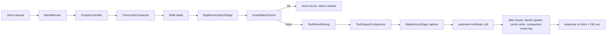

The cache key is computed *inside* `ExactMatchCache.run` — so anything that
ran before it (bandit-routed model, OutputController caps, compaction summary,
skill trim, bigmemory inject) is *baked into the key*. Anything after the
cache (dedup, compress, bigmemory capture) does not affect the key, which is
why dedup/compress can mutate prior tool_results without breaking cache
parity.

Each stage may write keys into `req.metadata`. The proxy reads those after
the upstream call to populate the row written to the `requests` table. The
dashboard then aggregates that table.

| Stage              | Metadata keys it sets                                                                    |
|--------------------|------------------------------------------------------------------------------------------|
| BanditRouter       | `bandit_bucket`, `bandit_original_model`, `bandit_mode`, `bandit_arm` / `bandit_shadow_arm`, `saved_by_bandit_usd` |
| OutputController   | `output_turn_class`, `output_cap_applied`, `output_cap_original`                         |
| TranscriptCompactor| `compact_dropped_messages`, `compact_dropped_tokens`, `compact_summary_tokens`           |
| SkillLoader        | `saved_tokens`, `saved_by_skills`                                                        |
| BigMemoryInjectStage | `bigmemory_injected_tokens`, `bigmemory_inject_session`, `bigmemory_inject_from_cache` |
| ExactMatchCache    | `cache_key` (and short-circuits on hit)                                                  |
| ToolResultDedup    | `saved_tokens`, `saved_by_dedup`                                                         |
| ToolOutputCompressor | `saved_tokens`, `saved_by_compress`                                                    |
| BigMemoryStage     | `bigmemory_captured`                                                                     |

Token-saving stages (`dedup`, `compress`, `skills`) increment a shared
`saved_tokens` counter *and* a stage-specific `saved_by_*` counter. The
dashboard uses the per-stage counters to render the breakdown table.

---

## 2. BanditRouter — Thompson-sampling model router

**File:** `pipeline/bandit.py`. Default mode: `shadow` (logs counterfactual,
never mutates). Set `TOKENQ_BANDIT_MODE=live` to actually route.

### Idea

For every request, classify the body into a *context bucket* (size + tools +
system + images + temp_zero), then maintain a Beta(α, β) per (bucket, arm)
where the arms are the Anthropic model tiers cheaper-than-or-equal-to the
user's chosen model. Sample θ ~ Beta(α, β) for each candidate; pick the
highest. Update α/β from a composite reward after the response.

The user's chosen model is the ceiling — never an *upgrade* (e.g. user asks
for haiku → no routing). `TIER_ORDER` is the ladder
`haiku → sonnet → opus`.

### Flow

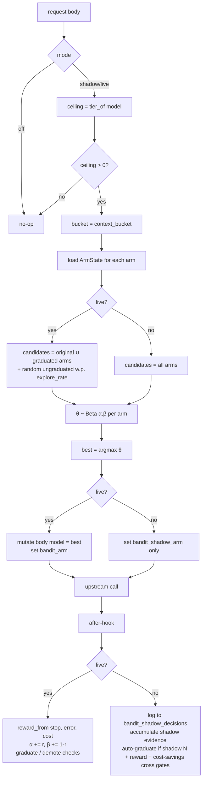

### Reward function (live mode)

`reward_from(stop_reason, error, cost_usd, cap=0.05)` →

- error or stop in (None, "error"): **0** (don't credit "failed cheaply")
- stop="end_turn": success=1.0
- stop="tool_use": success=0.9
- stop="max_tokens": success=0.2
- else: success=0.5
- `cost_score = 1 - min(cost / cap, 1)` ; cap = `$0.05` per call by default
- `reward = clip(0.7 * success + 0.3 * cost_score, 0, 1)`

### Shadow reward (counterfactual)

`estimate_shadow_reward(stop, error, output_tokens, has_tool_use)` —
conservative because the cheaper arm wasn't actually called:

- error/error-stop: 0
- max_tokens: 0.1
- output > 1500 tokens: 0.4 (long output is risky for cheaper arms)
- tool_use: 0.6
- end_turn: 1.0
- else: 0.5

### Graduation / demotion

A non-original arm is *graduated* (eligible in live mode) when one of:

- Manually unlocked, OR
- Live: `live_n ≥ 30` and `mean_reward ≥ 0.6`, OR
- Auto-promoted from shadow: `shadow_n ≥ 30`, `mean_shadow_success ≥ 0.6`,
  AND `(cost_full - cost_routed) / cost_full ≥ 0.30` (real cost win required)

Auto-promoted arms use a tighter demote floor (`0.55` vs `0.4`) — tokenq made
the call, so it backs off faster on quality dips. Demotion fires when the
trailing 20-call rolling mean drops below the floor.

### Where bandit savings show up

Live mode only: when the routed arm differs from the original, `intercept.py`
logs `saved_by_bandit_usd = max(0, cost_at_original - cost_at_routed)` per
request, summed in the `requests` table column `saved_by_bandit_usd`.

Shadow mode writes one row per request to `bandit_shadow_decisions` with
`est_cost_full_usd`, `est_cost_routed_usd`, `est_cost_saved_usd =
max(0, full - routed)`. The dashboard surfaces this as
`shadow_saved_usd` — a *what-would-we-have-saved* number that does **not** roll
into realized savings.

---

## 3. OutputController — turn-class-aware output caps

**File:** `pipeline/output.py`. Anthropic charges ~5× more for output than
input. This stage classifies the turn and applies caps.

### Classifier

`classify_turn(body)` returns one of:

- **`tool`** — last user message contains `tool_result` blocks, OR the prior
  assistant message had `tool_use` blocks → mid-agent loop
- **`code`** — last user message contains code-generation verbs
  (`implement`, `refactor`, `write a`, ...), or 30+ newlines, or a code fence
- **`qa`** — short conversational message; ≤600 chars with `?`, OR ≤240 chars
  with no tools
- **`unknown`** — fallback; no controls applied

### Levers (per class)

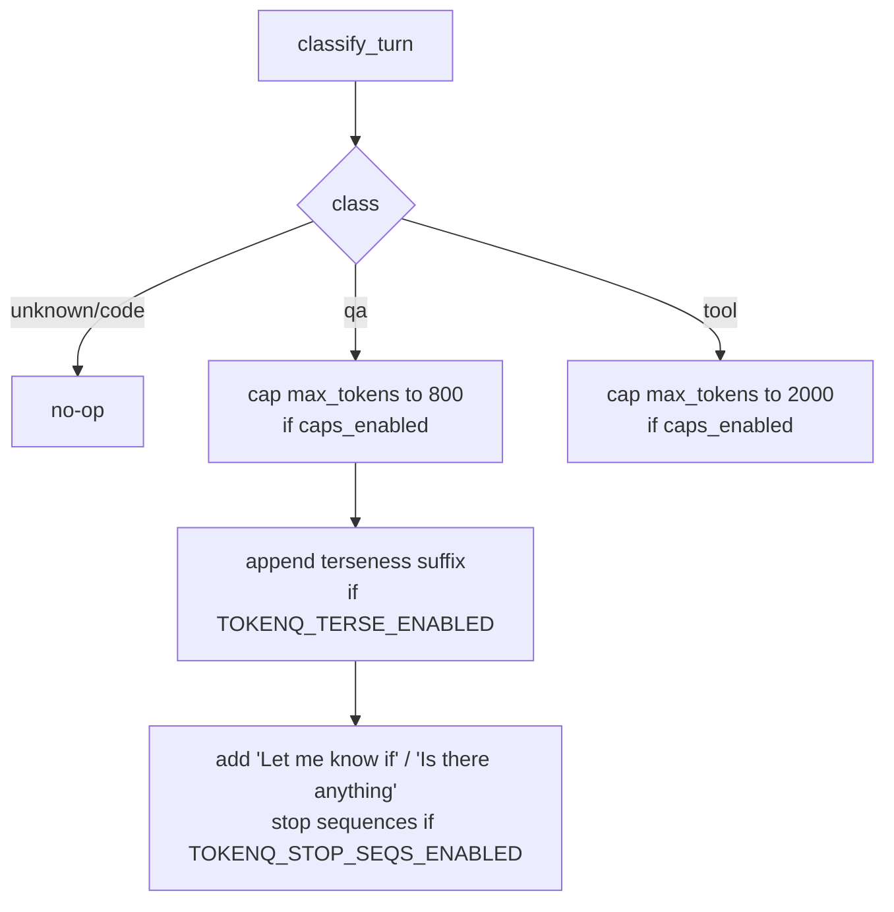

Caps default ON; terseness and stop sequences default OFF until measured.
The cap only fires when `original > ceiling`; existing tighter caps are
preserved. Terseness suffix is byte-stable (idempotent) so the prompt cache
keeps hitting.

### Effect on dashboard

OutputController doesn't write `saved_*` metadata; it just shrinks the
upstream call's output billing. Savings show up *implicitly* as a lower
`output_tokens` and `estimated_cost_usd` in the `requests` row. There's no
explicit "saved by output" metric.

---

## 4. TranscriptCompactor — sliding-window prefix compaction

**File:** `pipeline/compaction.py`. The biggest line item on a long Claude
Code session is `cache_read_input_tokens` — Anthropic charges 0.1× input rate
for every cached prefix byte, every turn. Trim the prefix once, save on
*every subsequent turn* until the next rollover.

### Idea

When the billed prefix (system + tools + messages) exceeds
`COMPACT_THRESHOLD_TOKENS` (default 80k), drop the oldest messages and
replace them with one stable summary marker. The cut point is *snapped to a
chunk boundary* so it stays byte-identical across turns within the chunk —
that's what lets Anthropic's prompt cache re-hit the new prefix.

### Flow

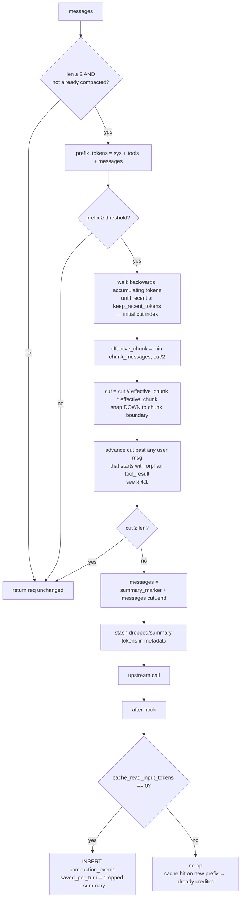

### 4.1 Orphan tool_result guard

Anthropic rejects a request whose first user message begins with a
`tool_result` whose paired `tool_use` is missing. If `cut` lands such that
`messages[cut]` is `user(tool_result for X)` and `messages[cut-1]` is
`assistant(tool_use X)` — which we're about to drop — the API errors with:

```
messages.0.content.1: unexpected `tool_use_id` found in `tool_result` blocks: <id>
```

`_advance_past_orphan_tool_results` walks `cut` forward past such messages.
The advance is deterministic in (immutable) prior contents, so cache
stability across turns survives.

### Cache stability invariant

Two turns within the same chunk window produce a *byte-identical* prefix:

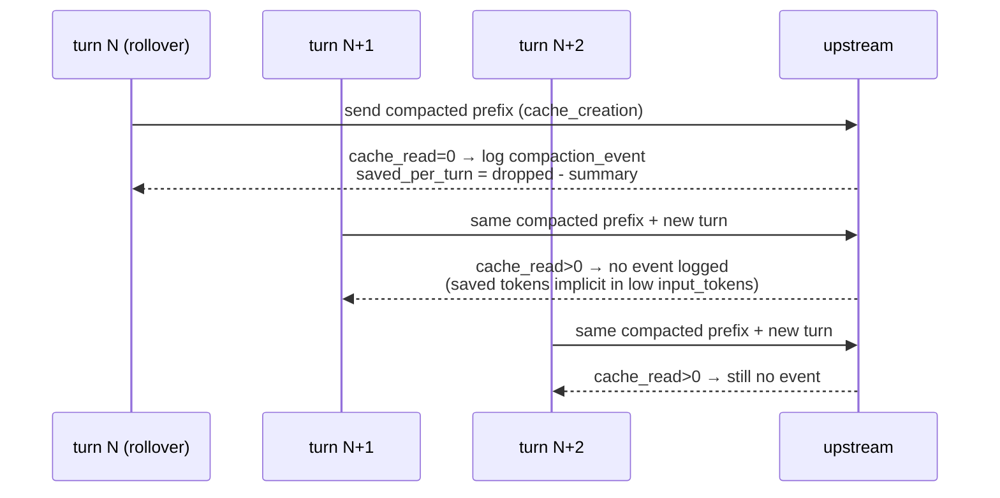

`compaction_events` therefore captures *per-rollover* savings, NOT per-turn.
The dashboard's "per-turn savings" is computed by summing `saved_per_turn`
across rollover events in the window — each row represents the recurring
savings on every cache-hit turn that follows it.

---

## 5. SkillLoader — relevance-prune skill descriptions

**File:** `pipeline/skills.py`. Many clients send a system prompt enumerating
a long library of skills, each with a paragraph-long description. Most are
irrelevant to the current turn.

### Flow

```mermaid
flowchart TD
    A[system prompt] --> B[parse '- name: description' bullets<br/>+ continuation lines]
    B --> C{≥ min_list bullets found?}
    C -- no --> Z[no-op]
    C -- yes --> D{≤ top_k AND no slash invocations?}
    D -- yes --> Z
    D -- no --> E[query = last user msg, tokenized minus stopwords]
    E --> F[score skill = name+desc tokens ∩ query tokens]
    F --> G[priority = 10⁶ if /skill explicitly invoked, else score]
    G --> H[take top_k by priority<br/>+ all explicitly invoked]
    H --> I[restore original order for kept bullets]
    I --> J[replace block: kept bullets + '(N hidden)' stub]
    J --> K[saved_tokens = saved_chars / 4]
    K --> L[req.metadata saved_by_skills += saved_tokens]
```

A `/<name>` mention in the user's text always keeps that skill (priority
10⁶), even if its description doesn't textually overlap the query. Original
ordering is preserved among kept entries so any documented sequencing
survives.

---

## 6. BigMemoryInjectStage — session-stable memory injection

**File:** `bigmemory/inject.py`. Off by default
(`TOKENQ_BIGMEMORY_INJECT=1` to enable). Injects the relevant slice of the
local memory store as an extra cache-controlled system block.

### Cache-stability trick

Naive "fresh top-N memories per turn" would change the prefix every turn and
destroy upstream cache. Instead:

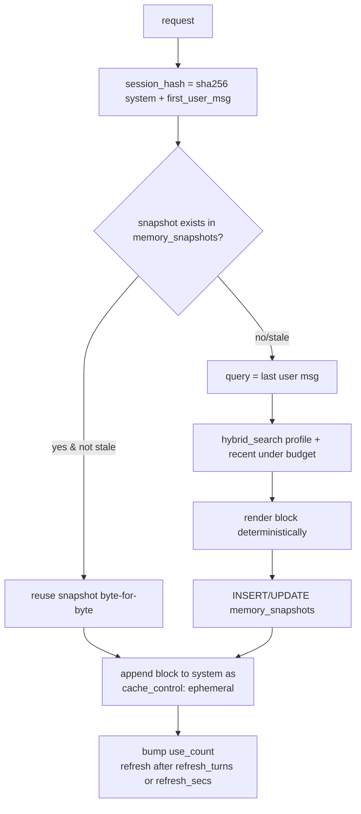

Two consecutive turns of the same session yield the same `session_hash`,
hence the same snapshot, hence the same bytes — upstream cache still hits.

### Effect on dashboard

The stage records `bigmemory_injected_tokens` per request but doesn't write a
direct savings counter. Indirect savings show up as fewer
`memory_search` MCP calls (each one would be its own input-token charge).

---

## 7. ExactMatchCache — local response cache

**File:** `pipeline/cache.py`. Pre-flight: hash a canonical subset of the
body and short-circuit on a hit. Post-flight: store on a successful,
deterministic, tool-use-free response.

### Key

```
sha256(json.dumps({
    model, messages, system, max_tokens, temperature,
    top_p, top_k, stop_sequences, stream
}, sort_keys=True))
```

`tools` is intentionally excluded — cache writes already require a
tool-use-free response, so the cached body is valid regardless of which tool
inventory the caller advertised.

### Hit / miss flow

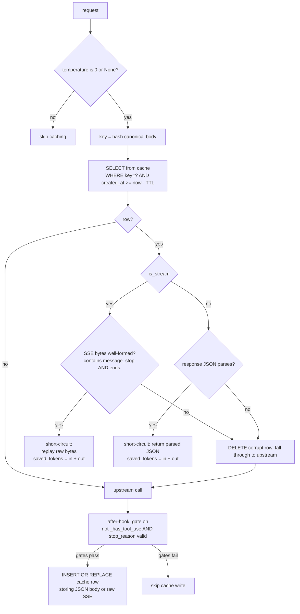

### Why output tokens count as savings

A cache hit means the upstream call **never happens**. So both the input AND
output tokens of the original request are saved. `intercept.py:184-194`
writes:

```
saved_by_cache = result.saved_tokens   # = original_input + original_output
cached_locally = 1
estimated_cost_usd = 0.0                # no upstream charge this turn
```

The dashboard's `_saved_usd_for_row` then prices `cache_saved_input` at the
input rate AND `cache_saved_output` at the output rate (≈ 5× input). This
fixed a previous undercount where everything was priced at input rate.

---

## 8. ToolResultDedup — stub repeated tool_result content

**File:** `pipeline/dedup.py`. When an agent re-reads the same file or
re-runs the same command, the prior `tool_result` is still in the messages
array. We replace later identical copies with a small reference stub.

### Flow

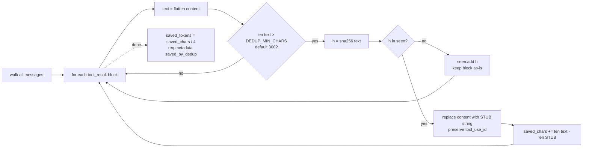

`tool_use_id` is preserved so the API still accepts the request — only the
content is stubbed. Dedup is ordered: the first instance is always kept,
later copies become stubs.

### Per-turn vs per-request scope

Dedup runs across the **entire request body** every turn. Earlier-turn
duplicates that already had matching tool_use_ids stubbed in a prior turn are
already small, so re-stubbing is a no-op. The new savings are dominated by
duplicates *within the latest turn's tool_results*.

---

## 9. ToolOutputCompressor — trim & ANSI-strip tool_result content

**File:** `pipeline/compress.py`. Three transforms, all conservative:

1. Strip ANSI escape codes (`\x1b\[...]`).
2. Collapse runs of ≥3 blank lines into a single blank line.
3. If a result body exceeds `COMPRESS_MAX_LINES` (default 80), keep first +
   last `COMPRESS_KEEP_LINES` (default 25) and replace the middle with
   `... [N lines omitted to save tokens] ...`.

### Flow

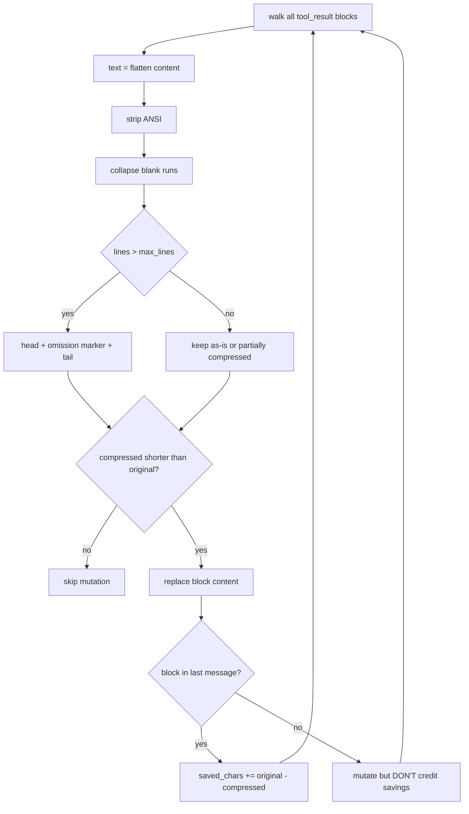

### The "only credit last-message savings" rule

This is critical and easy to miss. We mutate **every** tool_result every
turn so the wire bytes stay byte-stable across turns (which keeps Anthropic's
prompt cache hitting). But only tool_results in the **last message** are
*new* this turn — everything else was credited on a previous turn and is
now being read from upstream cache. Counting prior-turn savings every turn
was the over-counting bug `compress.py` shipped to fix.

---

## 10. BigMemoryStage — capture-only tool_result store

**File:** `bigmemory/pipeline.py`. Walks every `tool_result` block, stores
content above `BIGMEMORY_CAPTURE_MIN_TOKENS` (default 500) into the local
FTS5 store. Capture-only in v1; the request body is never mutated by this
stage. Active rewriting (`<memory id=42 tokens=12000/>` pointers) is the v2
work.

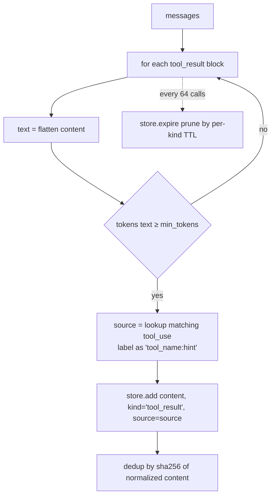

The store is also exposed as an MCP server (`bigmemory/mcp.py`) so the
client can `memory_search` on demand.

---

## 11. Dashboard metric reference

Every metric on the dashboard is derived from columns in three SQLite tables:

- `requests` — one row per `/v1/messages` call, written by `proxy/intercept.py`
- `compaction_events` — one row per *rollover*, written by `compaction.after`
  when `cache_read_input_tokens == 0`
- `bandit_shadow_decisions` — one row per shadow recommendation, written by
  `bandit.after_stream` / `bandit.after`

Below is the exact computation for each visible number, with file:line refs.

### 11.1 Bottom-line comparison (`comparison` block)

`dashboard/app.py:_collect_report` and `_saved_usd_for_row`.

| Field                | Formula                                                                                                                                  |
|----------------------|------------------------------------------------------------------------------------------------------------------------------------------|
| `with_tokenq_usd`    | `SUM(estimated_cost_usd)` over the window — what was actually billed by Anthropic.                                                       |
| `saved_usd`          | Σ `_saved_usd_for_row(model_row)` across `by_model` rows + `SUM(saved_by_bandit_usd)`.                                                   |
| `without_tokenq_usd` | `with_tokenq_usd + saved_usd` — counterfactual reconstructed by adding back what we skipped.                                            |
| `saved_pct`          | `100 * saved_usd / without_tokenq_usd` — savings as a fraction of the counterfactual, not actual.                                        |

`_saved_usd_for_row(row)` is the only place that monetizes saved tokens:

```python
saved_usd = (
    cache_saved_input  * input_rate(model)   # cache hits save input...
  + cache_saved_output * output_rate(model)  # ...AND output (model never ran)
  + noncache_saved_input * input_rate(model) # dedup/compress/skills only trim input
)
```

`input_rate` / `output_rate` come from `pricing.py:PRICING` (USD per million
tokens, divided by 1e6). `cache_saved_input/output` is summed over rows
where `cached_locally = 1`. `noncache_saved_input` is `saved_tokens` summed
over rows where `cached_locally = 0`.

Bandit savings are *USD-denominated already* (price differential between
routed and original tier, computed live in
`bandit._handle_observation`), so they're added directly without re-pricing.

### 11.2 Usage totals (`totals` block)

Pure SUM/COUNT/AVG over the `requests` table windowed by `ts ∈ [from, to)`:

| KPI               | SQL                                                                                       |
|-------------------|-------------------------------------------------------------------------------------------|
| requests          | `COUNT(*)`                                                                                |
| tokens            | `SUM(input_tokens) + SUM(output_tokens)` (rendered as one number)                         |
| cache reads       | `SUM(cache_read_tokens)` — Anthropic-side prompt-cache reads, *not* tokenq's local cache  |
| saved tokens      | `SUM(saved_tokens)` (union of saved_by_cache + saved_by_dedup + saved_by_compress + saved_by_skills, per request) |
| avg latency       | `AVG(latency_ms)` — wall-clock from request start to response complete                     |

Latency itself is recorded by `intercept.py`:
`latency_ms = int((time.monotonic() - started) * 1000)` measured around the
*entire* handler — pipeline + upstream + after-hooks. Cache hits short-circuit
the upstream call, so they record only the pipeline overhead (~1-5ms typically).

### 11.3 Savings-by-stage breakdown

Each stage column is summed over the window:

| Source     | Tokens                              | Requests                                                              |
|------------|-------------------------------------|-----------------------------------------------------------------------|
| cache      | `SUM(saved_by_cache)`               | `COUNT WHERE saved_by_cache > 0`                                      |
| dedup      | `SUM(saved_by_dedup)`               | `COUNT WHERE saved_by_dedup > 0`                                      |
| compress   | `SUM(saved_by_compress)`            | `COUNT WHERE saved_by_compress > 0`                                   |
| skills     | `SUM(saved_by_skills)`              | `COUNT WHERE saved_by_skills > 0`                                     |
| compaction | `SUM(saved_per_turn)` from `compaction_events` | `COUNT(*)` from `compaction_events` (each row = one rollover) |

`share %` = `tokens / total_saved_tokens * 100`. Note that compaction is
counted in `compaction_events`, not `requests` — this is because compaction
savings are *recurring* (every cache-hit turn until the next rollover), not
per-request.

### 11.4 Bandit / shadow KPIs

```sql
SELECT
  COUNT(*)                          AS shadow_decisions,
  SUM(est_cost_saved_usd)           AS shadow_saved_usd,
  SUM(est_cost_full_usd)            AS shadow_cost_full_usd,
  SUM(est_cost_routed_usd)          AS shadow_cost_routed_usd
FROM bandit_shadow_decisions
WHERE ts >= ? AND ts < ?
```

`est_cost_saved_usd` per row = `max(0, full - routed)` computed at write
time. Surfaced *separately* from realized `saved_usd` so users don't conflate
"would have saved" with "actually saved."

### 11.5 Time series (`/api/timeseries`, hourly or daily)

```sql
SELECT
  CAST(ts / B AS INTEGER) * B AS bucket,   -- B = 3600 or 86400
  COUNT(*)                       AS requests,
  SUM(input_tokens + output_tokens) AS tokens,
  SUM(saved_tokens)              AS saved_tokens,
  SUM(estimated_cost_usd)        AS spent_usd
FROM requests
WHERE ts >= ? AND ts < ?
GROUP BY bucket
ORDER BY bucket
```

Bucket size flips at the 3-day boundary: hourly for windows ≤ 3 days, daily
otherwise. Keeps the chart legible from `1h` to `30d`.

### 11.6 Per-model rollup (`/api/by_model`)

Groups by `model` (NULL/empty → `(other)`). Each row gets:

- `requests`, `input_tokens`, `output_tokens`, `cache_read_tokens`,
  `cache_creation_tokens`, `saved_tokens`, `spent_usd`, `avg_latency_ms`,
  `local_cache_hits` — straight aggregates
- `saved_usd` — model-specific monetization via `_saved_usd_for_row` plus
  `saved_by_bandit_usd` (the routed-to model gets the bandit credit).

### 11.7 Health grade (`/api/health`)

`dashboard/app.py:health` returns an A–F grade out of 100:

| Component             | Score breakdown                                                                  |
|-----------------------|----------------------------------------------------------------------------------|
| Upstream cache rate   | ≥70% → 35; ≥40% → 20; else 0. `100 * cache_read / (input + cache_read)`.         |
| Savings rate          | ≥30% → 35; ≥10% → 20; else 0. **Override:** if upstream cache ≥70% → 35 anyway (cache is doing the work, no waste left) |
| Error rate            | <1% → 30; <5% → 15; else 0. `100 * (status>=400) / requests`.                    |

Grade thresholds: `A ≥ 90 · B ≥ 75 · C ≥ 60 · D ≥ 40 · F < 40`.

The override on the savings line is important — a healthy session with high
upstream cache hit rate has *nothing left for tokenq to cut*, and shouldn't
be penalized for low pipeline savings.

### 11.8 Sessions / projects / tools / activity / shell / mcp

Each is a `GROUP BY` over the `requests` table on the corresponding column:

- **session** = `session_id` populated by the client header (sha of system +
  first user msg, set client-side or by intercept)
- **project** = working-directory basename, set client-side
- **tool** / **mcp** — JSON-decode `tools_used` (a list extracted by
  `proxy/observe.py`), credit each tool referenced. `mcp__server__fn` tools
  collapse to `server` for the MCP rollup.
- **activity** = `activity` column populated by `proxy/classify.py` — a
  codeburn-style classifier (`debugging`, `feature`, `refactor`, ...).
  Pre-classifier rows have `activity IS NULL` and are surfaced as a `legacy`
  count rather than a noisy "unclassified" bucket.

### 11.9 One-shot rate (`/api/oneshot`)

For each session, walk Edit-bearing requests in `ts` order. An Edit on file
X is a **retry** if any of the next 1–3 turns also Edits a file in the same
set. Otherwise it's a **one-shot**.

```
overall_one_shot_pct = 100 * one_shot_turns / (one_shot_turns + retry_turns)
```

`per_session` is sorted by `edit_turns` descending; top 20 returned.

---

## 12. Database tables — column-level guide

`storage.py` defines the schema. Key columns the dashboard reads:

### `requests`

| Column                  | Source                                                                |
|-------------------------|-----------------------------------------------------------------------|
| `ts`                    | `time.time()` at request start                                        |
| `model`                 | Final model on the upstream call (post-bandit if live)                |
| `input_tokens`          | `usage.input_tokens` from upstream response                            |
| `output_tokens`         | `usage.output_tokens` from upstream response                           |
| `cache_read_tokens`     | `usage.cache_read_input_tokens`                                        |
| `cache_creation_tokens` | `usage.cache_creation_input_tokens`                                    |
| `saved_tokens`          | Sum of all stage saved counters, OR `in+out` on a local cache hit      |
| `saved_by_cache`        | `result.saved_tokens` only on local-cache short-circuit                |
| `saved_by_dedup`        | `req.metadata["saved_by_dedup"]`                                       |
| `saved_by_compress`     | `req.metadata["saved_by_compress"]`                                    |
| `saved_by_skills`       | `req.metadata["saved_by_skills"]`                                      |
| `saved_by_bandit_usd`   | `max(0, cost_at_original - cost_at_routed)` in live mode               |
| `cached_locally`        | `1` if served from `ExactMatchCache`, `0` otherwise                    |
| `latency_ms`            | `(time.monotonic() - started) * 1000`                                  |
| `estimated_cost_usd`    | `pricing.estimate_cost(model, in, out, cache_create, cache_read)`      |
| `status_code`           | Upstream HTTP status (or 200 for local-cache hits)                     |
| `tools_used`            | JSON list of tool_use names from `proxy/observe.py`                    |
| `bash_verbs`            | JSON list of leading verbs from Bash tool_uses                         |
| `edit_files`            | JSON list of file paths from Edit tool_uses                            |
| `activity`              | Classifier label from `proxy/classify.py`                              |
| `session_id` / `project`| From client headers / classifier                                       |

### `compaction_events`

One row per *rollover* (when upstream rebuilt the cache):

| Column              | Meaning                                                          |
|---------------------|------------------------------------------------------------------|
| `dropped_messages`  | Count of messages replaced with the summary marker               |
| `dropped_tokens`    | Estimated tokens in the dropped messages                          |
| `summary_tokens`    | Tokens cost of the summary marker we wrote                        |
| `saved_per_turn`    | `max(0, dropped_tokens - summary_tokens)` — recurring per-turn savings |

### `bandit_shadow_decisions`

| Column                 | Meaning                                                       |
|------------------------|---------------------------------------------------------------|
| `bucket`               | `context_bucket(body)` — `s|m|l|xl|t=0|sys=1|img=0|t0=1` etc. |
| `original_arm`         | The model the user asked for                                  |
| `recommended_arm`      | The model the bandit *would* have routed to                   |
| `est_success`          | `estimate_shadow_reward(...)` ∈ [0,1]                         |
| `est_cost_full_usd`    | What the original arm cost                                    |
| `est_cost_routed_usd`  | What the recommended arm would have cost at the same usage    |
| `est_cost_saved_usd`   | `max(0, full - routed)`                                       |

### `cache`

`(key, response, model, input_tokens, output_tokens, created_at, last_hit_at, hit_count, is_stream)`.
`is_stream=1` rows store raw SSE bytes; `is_stream=0` rows store JSON. TTL
gate in `ExactMatchCache.run` is `created_at >= now - CACHE_TTL_SEC`
(default 1 day).

### `bandit_state`

`(arm, params, updated_at)` where `arm = f"{bucket}::{model}"` and `params`
is a JSON-encoded `ArmState` (α, β, n, live_n, recent_rewards window,
shadow stats, graduation flags).

### `memory_items` / `memory_snapshots`

Bigmemory store. Captured tool_results live in `memory_items`; per-session
inject snapshots live in `memory_snapshots`. Capture is dedup'd by
`sha256(normalized_content)`; per-kind TTLs run on a sweep every 64 pipeline
calls.

### `skill_compressions`

Offline `tokenq compress-skill` rewrites — not bound to the request window.
Each row: `(ts, path, output_path, model, before_tokens, after_tokens, saved_tokens)`.

---

## 13. End-to-end timing of one turn

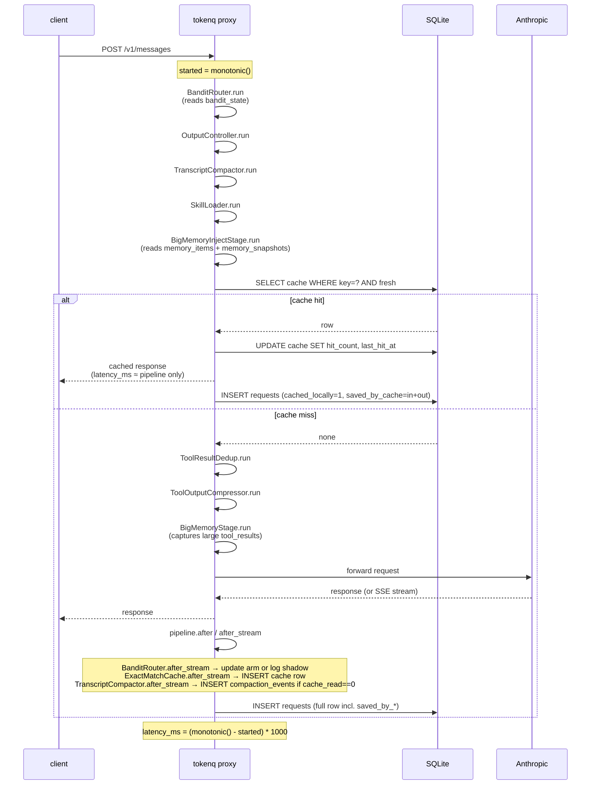

`latency_ms` is the entire turn from receipt to completion, so it includes
pipeline + upstream + after-hook write time. The dashboard's "avg latency" is
`AVG(latency_ms)` over the window — useful for spotting regressions but not
broken down per stage. Per-stage timing isn't currently tracked.

---

## 14. Multi-turn conversations: how history accumulates

### 14.1 The premise

The Claude API is **stateless**. There is no server-side conversation; every
turn the client re-sends the **entire history** in the `messages` array.

```
turn 1: [u₁]
turn 2: [u₁, a₁, u₂]
turn 3: [u₁, a₁, u₂, a₂, u₃]
turn 4: [u₁, a₁, u₂, a₂, u₃, a₃, u₄]   ← grows linearly per turn
…
turn N: [u₁, a₁, …, u_{N-1}, a_{N-1}, u_N]
```

For an agentic client (Claude Code), each `aᵢ` may include `tool_use` blocks
and each `uᵢ₊₁` may include matching `tool_result` blocks. Tool results are
the dominant byte source — a single file read can be 50KB, and that 50KB is
re-sent on every subsequent turn until the conversation ends.

### 14.2 What Anthropic's prompt cache does

Anthropic charges 3 different rates for the input prefix:

| Tier            | Rate (vs base input) | When it applies                                   |
|-----------------|----------------------|---------------------------------------------------|
| base input      | 1.0×                 | Bytes the upstream has never seen                 |
| cache_creation  | 1.25×                | First time a cacheable prefix is sent             |
| cache_read      | **0.10×**            | Re-hits of a byte-identical, recently-seen prefix |

A long agentic session naturally re-sends a giant identical prefix every
turn. If the client marks cache breakpoints right and **nothing on the path
mutates the prefix bytes**, every turn after the first reads at 0.10× — a
~10× discount on the input cost.

This is the lever everything in tokenq is built around. Most of the
"savings" you see on the dashboard are actually *preserved cache hits*, not
new bytes that never went out.

### 14.3 The cache-stability invariant

Every stage is classified by what it does to the byte stream across turns:

| Stage                | Effect across turns                                                                                  |
|----------------------|------------------------------------------------------------------------------------------------------|
| BanditRouter         | May change `model` once per (bucket) and stay sticky thereafter. Cache key includes model, so a route change is one cache rebuild then steady. |
| OutputController     | Caps `max_tokens`; appends a **byte-stable, idempotent** terseness suffix to system. Re-running on the same conversation produces identical bytes. |
| TranscriptCompactor  | Replaces the oldest N messages with a deterministic `[tokenq compacted N earlier messages …]` marker, **snapped to a chunk boundary** so the prefix stays identical for many turns within the chunk. |
| SkillLoader          | ⚠ Re-scores against the **latest** user message every turn. The kept top-K can change → system bytes change → cache invalidates. Use only when the trim ratio is large enough to outweigh the cache-rebuild cost. |
| BigMemoryInjectStage | Caches one snapshot per `session_hash = sha256(system, first_user_msg)` and reuses it byte-for-byte across turns. Refreshed every N turns or M seconds. |
| ExactMatchCache      | Read-only on the prefix; doesn't mutate body.                                                        |
| ToolResultDedup      | Mutates **all** tool_results every turn — but mutation is a function of `(content_hash, position)`, deterministic. The prefix bytes stabilize after the first turn that introduced each duplicate. |
| ToolOutputCompressor | Same: mutates **every** tool_result every turn so the bytes are byte-stable, even though only the last-message savings are *credited* this turn. |
| BigMemoryStage       | Capture-only — never mutates the body.                                                               |

**Rule:** anything that breaks byte-stability of the prefix has to save more
tokens than the cache-rebuild costs (roughly: `saved_tokens > 1.15 *
prefix_tokens`, since a rebuild costs `1.25× - 0.10× = 1.15×` of the prefix
in counterfactual savings forfeited). That's why dedup/compress mutate every
turn (otherwise turn-1's compressed bytes wouldn't match turn-2's
recomputed compression on the same content) and why the bigmemory inject
stage uses session-snapshot reuse instead of fresh per-turn ranking.

### 14.4 What runs on every turn vs once-per-rollover

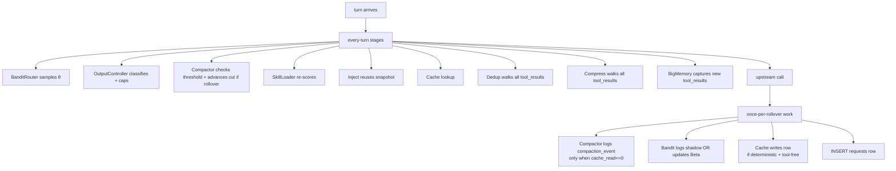

### 14.5 Compaction in action — turn-by-turn timeline

Suppose a session has these per-turn billed-prefix sizes (system + tools +
messages, in tokens) and cache states:

| Turn | Prefix tokens | What happens                                                                                       | Anthropic charges                |
|------|---------------|---------------------------------------------------------------------------------------------------|----------------------------------|
| 1    | 30,000        | First turn. Compactor: `30k < 80k threshold`, no-op. Cache miss.                                  | 30k @ 1.25× (cache_creation)     |
| 2    | 32,000        | Same prefix + 2k new bytes. Cache hit on 30k of the 32k.                                          | 30k @ 0.10× + 2k @ 1.25×         |
| …    | …             | …                                                                                                  |                                   |
| 12   | 79,000        | Just under threshold. Cache hit on 77k.                                                            | 77k @ 0.10× + 2k @ 1.25×         |
| 13   | **82,000**    | **Crosses 80k threshold.** Compactor walks back from end accumulating tokens until it has 20k of "recent." Suppose that puts the cut at message index 26 → snapped down to 20 (chunk boundary) → advanced past one orphan tool_result → cut=21. Drops 21 messages = ~58k tokens. New summary marker = ~30 tokens. New prefix = ~24k tokens. **`cache_read_input_tokens == 0`** → log compaction_event with `saved_per_turn = 58000 - 30 ≈ 57,970`. | 24k @ 1.25× (full rebuild)       |
| 14   | 26,000        | Same compacted prefix + 2k new. **cache_read > 0** → no event logged this turn (already credited). | 24k @ 0.10× + 2k @ 1.25×         |
| 15   | 28,000        | Same. cache_read > 0.                                                                              | 24k @ 0.10× + 2k @ 1.25×         |

**Per-turn savings vs counterfactual** (no compaction would have been
~80k+ at 0.10× every turn): from turn 14 onward, every turn pays
`24k × 0.10× + 2k × 1.25×` ≈ 4.9k effective input units instead of
`82k × 0.10×` = 8.2k. That's ~3.3k tokens saved per turn × 50 more turns
before the next rollover = ~165k tokens saved over the chunk window, for a
one-time rebuild cost of `24k × 1.15× = 27.6k` extra paid on turn 13.
Net win once `turns_to_next_rollover ≥ 9`.

**This is why `compaction_events.saved_per_turn` is a recurring number, not
a one-shot.** The dashboard sums `saved_per_turn` across rollover events in
the window — each row represents the savings on every cache-hit turn that
follows it until the next rollover.

### 14.6 What "saved tokens" counts on each turn

The accounting rule across turns is subtle:

| Stage                | Counting rule                                                                                                                                                         |
|----------------------|----------------------------------------------------------------------------------------------------------------------------------------------------------------------|
| ExactMatchCache      | On hit, credits **input_tokens + output_tokens** of the *cached* response. Per-turn: at most one credit, since the upstream call was skipped.                          |
| ToolResultDedup      | Credits **every duplicate found this request**, but earlier-turn duplicates were already small (stubbed on a previous turn) so re-stubbing is a noop. New savings ≈ duplicates introduced this turn. |
| ToolOutputCompressor | Mutates every tool_result every turn for byte stability, but **only credits savings from tool_results in the *last* message**. Earlier-turn tool_results were credited on the turn they were new and are now read from upstream cache. |
| SkillLoader          | Credits the diff `len(text) - len(rebuilt_text)` every turn. If the kept top-K changes turn-to-turn, the diff oscillates — **but the savings are real every turn** because the model still saw fewer skills. |
| BanditRouter         | Live mode: credits `cost_at_original - cost_at_routed` per request the routed arm differed.                                                                            |
| TranscriptCompactor  | Credits `dropped - summary` *once per rollover event*. The dashboard amortizes this across the cache-hit turns that follow.                                            |
| BigMemoryStage       | Doesn't credit tokens — capture only.                                                                                                                                  |

The `requests.saved_tokens` column is the union of `saved_by_cache +
saved_by_dedup + saved_by_compress + saved_by_skills` for that *single
request*. Compaction savings are NOT in that column — they live in
`compaction_events` and are added to the bottom-line "saved $" via a
separate `_saved_usd_for_row`-equivalent calculation in the report
collector.

### 14.7 Where session identity comes from

Several features key on a session ID even though the API itself doesn't
have one:

| Feature                          | Definition                                                                                  |
|----------------------------------|---------------------------------------------------------------------------------------------|
| BigMemoryInjectStage snapshot    | `session_hash = sha256(system + first_user_msg)`                                            |
| Dashboard `session_id`           | Set client-side via the `x-tokenq-session` request header (or computed by the proxy)        |
| Bandit context bucket            | NOT session-scoped — `(size band, has_tools, has_system, has_imgs, temp_zero)`              |
| Cache key                        | Hash of (model, messages, system, max_tokens, temperature, top_p, top_k, stop_sequences, stream) — implicitly session-scoped because `messages` is the entire history |

So two requests in the same session that differ only by the latest user
message will share `session_hash` (bigmemory) but have different cache keys
(ExactMatchCache).

### 14.8 The two cache layers

There are two caches, and people confuse them:

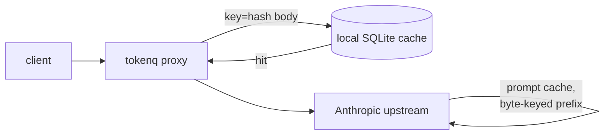

| Property                  | Local cache (`ExactMatchCache`)                | Upstream prompt cache (Anthropic)              |
|---------------------------|-----------------------------------------------|------------------------------------------------|
| Where it lives            | tokenq SQLite on the user's machine            | Anthropic's infrastructure                     |
| Key                       | Hash of full canonical body                    | Byte-identical prefix up to a cache breakpoint |
| What it skips             | The entire upstream call                       | Re-billing the prefix at base input rate        |
| How much it saves         | 100% of input + output cost (call never happens) | 90% of prefix input cost (0.10× vs 1.0×)      |
| Multi-turn hit rate       | Low — keyed on full history, so usually only useful for re-runs | High — designed for exactly this   |
| Visible on dashboard      | `saved_by_cache`, `cached_locally=1`           | `cache_read_tokens` column                     |

Most multi-turn savings flow through the **upstream** cache, which tokenq
doesn't operate but actively protects through every stage's byte-stability
discipline. Local cache hits are a smaller, opportunistic win — typically
on retries, replays, or test reruns.

### 14.9 Failure modes you'd see in the dashboard

What it looks like when multi-turn behavior breaks:

| Symptom                                                                                  | Likely cause                                                                                                  |
|-----------------------------------------------------------------------------------------|--------------------------------------------------------------------------------------------------------------|
| `cache_read_tokens` is near zero on a long session                                       | Some prefix-mutating stage is running with a non-deterministic transform — check SkillLoader if enabled, or a client mutating system between turns. |
| `compaction_events` grows quickly (>1 per ~20 turns)                                     | Cut isn't sticking on a chunk boundary — likely `chunk_messages` is too small for the message count in this transcript. Compactor auto-shrinks `effective_chunk` to `max(1, cut//2)` to handle this; if it's still rolling fast, the threshold is set too low. |
| API 400s with `unexpected tool_use_id found in tool_result blocks`                       | Pre-fix-§4.1 bug where the cut orphaned a tool_result. Should not happen on current `main`.                  |
| `saved_by_compress` is large but `cache_read_tokens` is also low                         | Compress is mutating bytes per turn somehow — probably the per-turn output of `_compress_text` isn't fully deterministic on identical input. Inspect a captured request body diff across turns. |
| `saved_usd` flat despite high `saved_tokens`                                             | Tokens are being saved by stages that only trim *input* (dedup/compress/skills), but counted alongside cache hits in `saved_tokens`. Output savings only flow when `cached_locally=1`. The split is in `_saved_usd_for_row`. |
